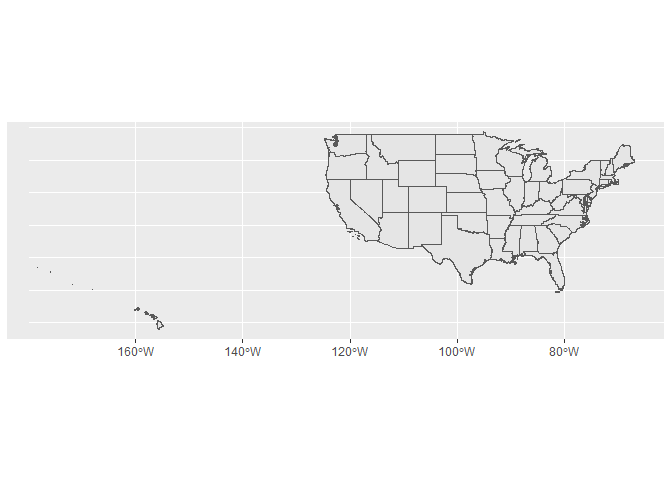

So I’ve been playing around with shapefiles to solve our Alaska and
Hawaii problem. Unfortunately, it’s just a game of wack-a-mole, solve
one problem and another one pops up.

The first problem is that ggplot doesn’t have a shapefile of the US that
includes Alasak and Hawaii (I think that was intentional). That’s an
easy fix. There is a package called
[tigris](https://cran.r-project.org/web/packages/tigris/index.html) that
can download all sorts of shape files from the Census Bureau.

So let’s download a shapefile for the states and plot.

``` r
library(tigris)
library(tidyverse)

states <- states(cb = TRUE, class = "sf") 
```

    ##   |                                                                              |                                                                      |   0%  |                                                                              |=                                                                     |   1%  |                                                                              |=                                                                     |   2%  |                                                                              |==                                                                    |   2%  |                                                                              |==                                                                    |   3%  |                                                                              |===                                                                   |   4%  |                                                                              |===                                                                   |   5%  |                                                                              |====                                                                  |   5%  |                                                                              |====                                                                  |   6%  |                                                                              |=====                                                                 |   7%  |                                                                              |=====                                                                 |   8%  |                                                                              |======                                                                |   8%  |                                                                              |======                                                                |   9%  |                                                                              |=======                                                               |  10%  |                                                                              |========                                                              |  11%  |                                                                              |========                                                              |  12%  |                                                                              |=========                                                             |  12%  |                                                                              |=========                                                             |  13%  |                                                                              |=========                                                             |  14%  |                                                                              |==========                                                            |  14%  |                                                                              |==========                                                            |  15%  |                                                                              |===========                                                           |  15%  |                                                                              |===========                                                           |  16%  |                                                                              |============                                                          |  17%  |                                                                              |============                                                          |  18%  |                                                                              |=============                                                         |  18%  |                                                                              |=============                                                         |  19%  |                                                                              |==============                                                        |  19%  |                                                                              |==============                                                        |  20%  |                                                                              |==============                                                        |  21%  |                                                                              |===============                                                       |  21%  |                                                                              |===============                                                       |  22%  |                                                                              |================                                                      |  22%  |                                                                              |================                                                      |  23%  |                                                                              |=================                                                     |  24%  |                                                                              |=================                                                     |  25%  |                                                                              |==================                                                    |  25%  |                                                                              |==================                                                    |  26%  |                                                                              |===================                                                   |  27%  |                                                                              |===================                                                   |  28%  |                                                                              |====================                                                  |  28%  |                                                                              |====================                                                  |  29%  |                                                                              |=====================                                                 |  30%  |                                                                              |=====================                                                 |  31%  |                                                                              |======================                                                |  31%  |                                                                              |======================                                                |  32%  |                                                                              |=======================                                               |  33%  |                                                                              |=======================                                               |  34%  |                                                                              |========================                                              |  34%  |                                                                              |========================                                              |  35%  |                                                                              |=========================                                             |  35%  |                                                                              |=========================                                             |  36%  |                                                                              |==========================                                            |  37%  |                                                                              |===========================                                           |  38%  |                                                                              |===========================                                           |  39%  |                                                                              |============================                                          |  39%  |                                                                              |============================                                          |  40%  |                                                                              |============================                                          |  41%  |                                                                              |=============================                                         |  41%  |                                                                              |=============================                                         |  42%  |                                                                              |==============================                                        |  42%  |                                                                              |==============================                                        |  43%  |                                                                              |===============================                                       |  44%  |                                                                              |===============================                                       |  45%  |                                                                              |================================                                      |  45%  |                                                                              |================================                                      |  46%  |                                                                              |=================================                                     |  47%  |                                                                              |==================================                                    |  48%  |                                                                              |==================================                                    |  49%  |                                                                              |===================================                                   |  49%  |                                                                              |===================================                                   |  50%  |                                                                              |===================================                                   |  51%  |                                                                              |====================================                                  |  51%  |                                                                              |====================================                                  |  52%  |                                                                              |=====================================                                 |  53%  |                                                                              |======================================                                |  55%  |                                                                              |=======================================                               |  55%  |                                                                              |========================================                              |  57%  |                                                                              |========================================                              |  58%  |                                                                              |=========================================                             |  58%  |                                                                              |=========================================                             |  59%  |                                                                              |==========================================                            |  60%  |                                                                              |===========================================                           |  61%  |                                                                              |============================================                          |  62%  |                                                                              |============================================                          |  63%  |                                                                              |=============================================                         |  64%  |                                                                              |==============================================                        |  65%  |                                                                              |==============================================                        |  66%  |                                                                              |===============================================                       |  67%  |                                                                              |================================================                      |  68%  |                                                                              |================================================                      |  69%  |                                                                              |=================================================                     |  70%  |                                                                              |==================================================                    |  71%  |                                                                              |==================================================                    |  72%  |                                                                              |===================================================                   |  72%  |                                                                              |===================================================                   |  73%  |                                                                              |===================================================                   |  74%  |                                                                              |====================================================                  |  74%  |                                                                              |====================================================                  |  75%  |                                                                              |=====================================================                 |  75%  |                                                                              |=====================================================                 |  76%  |                                                                              |======================================================                |  77%  |                                                                              |======================================================                |  78%  |                                                                              |=======================================================               |  78%  |                                                                              |=======================================================               |  79%  |                                                                              |========================================================              |  79%  |                                                                              |========================================================              |  80%  |                                                                              |=========================================================             |  81%  |                                                                              |==========================================================            |  82%  |                                                                              |==========================================================            |  83%  |                                                                              |===========================================================           |  84%  |                                                                              |===========================================================           |  85%  |                                                                              |============================================================          |  85%  |                                                                              |============================================================          |  86%  |                                                                              |=============================================================         |  87%  |                                                                              |==============================================================        |  88%  |                                                                              |==============================================================        |  89%  |                                                                              |===============================================================       |  89%  |                                                                              |===============================================================       |  90%  |                                                                              |===============================================================       |  91%  |                                                                              |================================================================      |  91%  |                                                                              |================================================================      |  92%  |                                                                              |=================================================================     |  93%  |                                                                              |==================================================================    |  94%  |                                                                              |==================================================================    |  95%  |                                                                              |===================================================================   |  95%  |                                                                              |===================================================================   |  96%  |                                                                              |====================================================================  |  97%  |                                                                              |===================================================================== |  98%  |                                                                              |===================================================================== |  99%  |                                                                              |======================================================================| 100%

``` r
#setting cb = TRUE downloads a "less detailed" map, 
#but it doesn't screw up the upper peninsula. Make sure class = "sf" to get a shapefile, THIS IS IMPORTANT

ggplot()+
  geom_sf(data = states)+
  coord_sf()
```

<!-- -->

This actually works quite well. But we get all this extra stuff. Looking
at the documentation for the *states* function we discover

> States and Equivalent Entities are the primary governmental divisions
> of the United States. In addition to the 50 states, **the Census
> Bureau treats the District of Columbia, Puerto Rico, American Samoa,
> the Commonwealth of the Northern Mariana Islands, Guam, and the U.S.
> Virgin Islands as the statistical equivalents of states for the
> purpose of data presentation.**

This is a bit of an inconvience, but let’s take a look at our shapefile.

``` r
head(states)
```

    ## Simple feature collection with 6 features and 9 fields
    ## geometry type:  MULTIPOLYGON
    ## dimension:      XY
    ## bbox:           xmin: -103.0026 ymin: 28.92861 xmax: -75.24227 ymax: 40.6388
    ## geographic CRS: NAD83
    ##   STATEFP  STATENS    AFFGEOID GEOID STUSPS           NAME LSAD        ALAND
    ## 1      28 01779790 0400000US28    28     MS    Mississippi   00 121533519481
    ## 2      37 01027616 0400000US37    37     NC North Carolina   00 125923656064
    ## 3      40 01102857 0400000US40    40     OK       Oklahoma   00 177662925723
    ## 4      51 01779803 0400000US51    51     VA       Virginia   00 102257717110
    ## 5      54 01779805 0400000US54    54     WV  West Virginia   00  62266474513
    ## 6      22 01629543 0400000US22    22     LA      Louisiana   00 111897594374
    ##        AWATER                       geometry
    ## 1  3926919758 MULTIPOLYGON (((-88.50297 3...
    ## 2 13466071395 MULTIPOLYGON (((-75.72681 3...
    ## 3  3374587997 MULTIPOLYGON (((-103.0026 3...
    ## 4  8528531774 MULTIPOLYGON (((-75.74241 3...
    ## 5   489028543 MULTIPOLYGON (((-82.6432 38...
    ## 6 23753621895 MULTIPOLYGON (((-88.8677 29...

Luckily, our shapefile (this is why you have to make sure *class =
“sf”*) includes the name of the area being mapped. This means we can
easily filter out the states that aren’t really states.

``` r
not_states <- c("United States Virgin Islands", "Puerto Rico", "Guam", "Commonwealth of the Northern Mariana Islands", "American Samoa")

real_states <- states %>% 
  filter(!(NAME %in% not_states))

nrow(real_states)
```

    ## [1] 51

We know our filter worked because there are now 51 observations (50
states plus DC).

Let’s map this updated data.

``` r
ggplot()+
  geom_sf(data = real_states)+
  coord_sf()
```

<!-- -->

This is much better than before. However, there is still a piece being
mapped all the way on the right. As it turns out, that is part of
Alaska. Maps are usually “cut” at the
[antimeridian](https://en.wikipedia.org/wiki/180th_meridian) which
separates parts of the [Aleutian
Islands](https://en.wikipedia.org/wiki/Aleutian_Islands) which is mostly
owned by Alaska.

If we remove Alaska from our shapefile, we can see the difference.

``` r
no_alaska <- real_states %>% 
  filter(NAME != "Alaska")

nrow(no_alaska)
```

    ## [1] 50

nrow verifies this filter worked

``` r
ggplot()+
  geom_sf(data = no_alaska)+
  coord_sf()
```

<!-- -->

This looks much better, but we had to let got of Alaska 😭

So I guess we have a few solutions.

  - Just deal with it 🔥 😎 🔥
  - Remove Alaska and Hawaii
      - maybe make seperate maps from them. This would require being
        able to reliably filter them out of any additional data
  - Find some other shapefile that cuts Alaska off at the antimeridian
  - Find some other shape file that creates an inset for Alaska and
    Hawaii (likely most ideal)
      - The challenge here would be that any coordinates would have to
        be converted to place correctly on the altered shape file
        (probably not impossible though)
